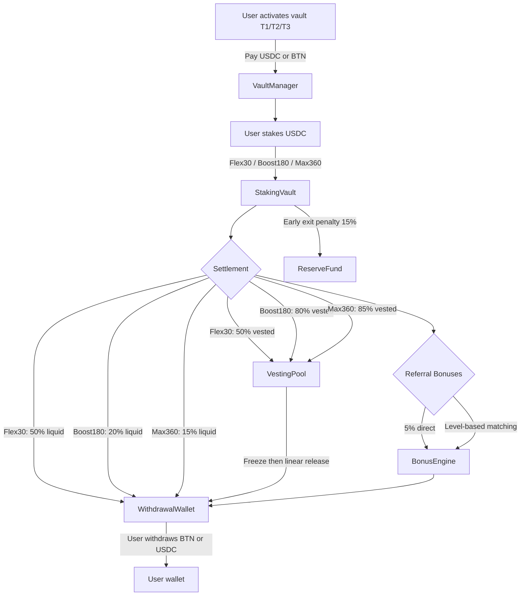
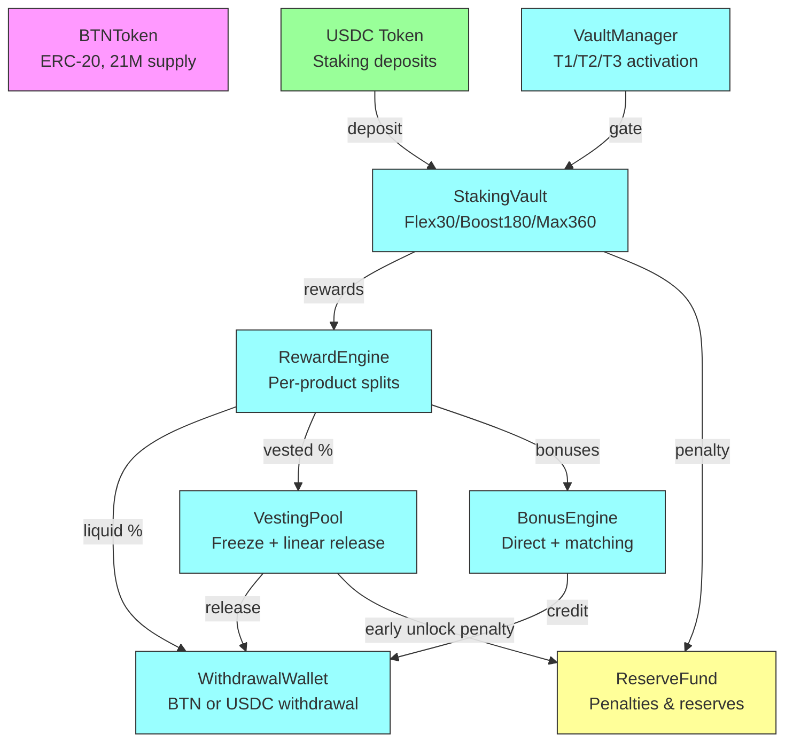
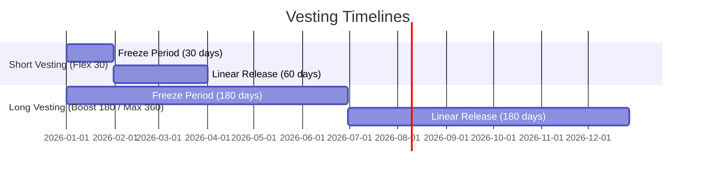
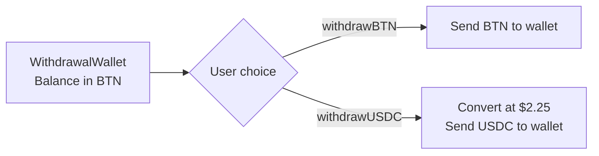
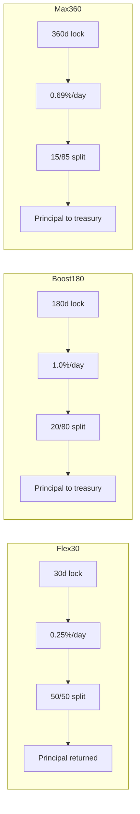
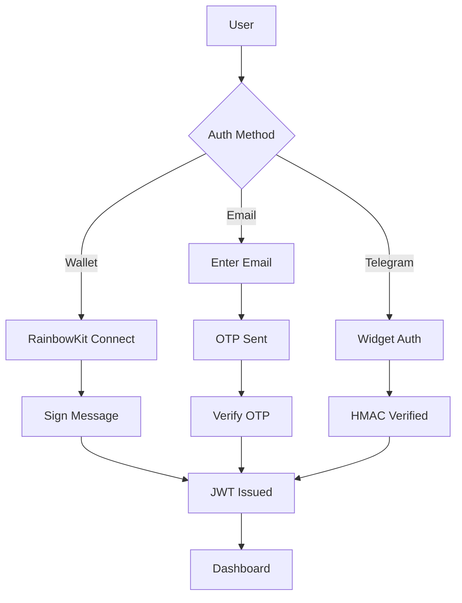

# BitTON.AI -- System Diagrams (V2)

## 1. Staking & Reward Lifecycle (V2)

## 2. Contract Architecture (V2)

## 3. Vesting Schedule (V2)

## 4. Dual-Token Withdrawal Flow

## 5. Product Comparison

## 6. Auth Flow (Multi-Method)

